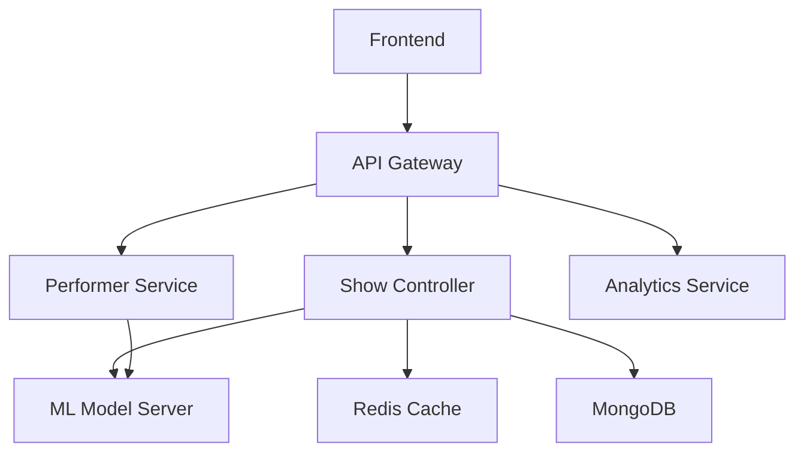

# Not Kill Tony System Documentation

## Table of Contents
1. System Overview
2. Architecture
3. Installation Guide
4. Configuration
5. Operation Procedures
6. Maintenance
7. Troubleshooting
8. API Reference
9. Security Guidelines
10. Backup & Recovery
11. Health Monitoring
12. Glossary

## 1. System Overview

### 1.1 Purpose
AI Kill Tony is an automated comedy show platform that simulates the popular Kill Tony podcast format using artificial intelligence. The system manages virtual performers, audience interactions, and show flow autonomously.

### 1.2 Key Components
- Virtual Host System
- Performer Generation Engine
- Audience Interaction Module
- Real-time Analytics
- Performance Optimization System
- Backup & Recovery System

## 2. Architecture

### 2.1 System Architecture
The system follows a microservices architecture with the following key services:



### 2.2 Data Flow
1. User requests initiate through the Frontend
2. API Gateway routes requests to appropriate services
3. Services process requests and interact with the ML Model Server
4. Results are cached in Redis for performance
5. Persistent data is stored in MongoDB

## 3. Installation Guide

### 3.1 Prerequisites
- Docker v20.10 or higher
- Kubernetes v1.22 or higher
- Node.js v18 or higher
- Redis v6.2 or higher
- MongoDB v5.0 or higher

### 3.2 Installation Steps
```bash
# Clone repository
git clone https://github.com/your-org/killtony.git

# Install dependencies
cd killtony
npm install

# Configure environment
cp .env.example .env
# Edit .env with your configuration

# Start services
docker-compose up -d
```

## 4. Configuration

### 4.1 Environment Variables
```env
# API Configuration
API_PORT=4000
API_VERSION=v1
API_TIMEOUT=30000

# ML Model Configuration
MODEL_SERVER_URL=http://localhost:8501
MODEL_CACHE_TTL=3600

# Database Configuration
MONGODB_URI=mongodb://localhost:27017/killtony
REDIS_URL=redis://localhost:6379
```

### 4.2 Performance Tuning
- Model inference optimization settings
- Caching strategies
- Resource allocation guidelines

## 5. Operation Procedures

### 5.1 Starting a Show
1. Access the admin dashboard
2. Configure show parameters
3. Initialize virtual hosts
4. Start audience admission
5. Begin show sequence

### 5.2 Monitoring
- Real-time performance metrics
- Audience engagement tracking
- System health monitoring
- Error logging and alerts

## 6. Maintenance

### 6.1 Routine Maintenance
- Daily backup verification
- Log rotation
- Cache cleaning
- Performance optimization

### 6.2 Update Procedures
```bash
# Update system
git pull origin main
npm install
docker-compose pull
docker-compose up -d

# Verify update
npm run test
```

## 7. Troubleshooting

### 7.1 Common Issues
| Issue | Possible Cause | Solution |
|-------|---------------|----------|
| High Latency | Cache miss | Verify Redis connection |
| Model Errors | GPU memory | Restart ML service |
| Audio Sync | Network delay | Check bandwidth |

### 7.2 Logging
```javascript
// Log levels and usage
logger.error('Critical system error', error);
logger.warn('Performance degradation detected');
logger.info('Show started successfully');
logger.debug('Processing performer request');
```

## 8. API Reference

### 8.1 REST API
```typescript
// Show Management
POST /api/v1/shows/start
GET /api/v1/shows/{id}
PUT /api/v1/shows/{id}/pause
DELETE /api/v1/shows/{id}

// Performer Management
POST /api/v1/performers
GET /api/v1/performers/{id}
PUT /api/v1/performers/{id}
DELETE /api/v1/performers/{id}
```

### 8.2 WebSocket Events
```typescript
// Event types
interface ShowEvents {
  'show:start': (showId: string) => void;
  'performer:ready': (performerId: string) => void;
  'audience:reaction': (reaction: Reaction) => void;
}
```

## 9. Security Guidelines

### 9.1 Access Control
- Role-based access control (RBAC)
- API authentication
- Session management
- Rate limiting

### 9.2 Data Protection
```typescript
// Data encryption example
interface SecurityConfig {
  encryption: {
    algorithm: 'aes-256-gcm';
    keyRotationInterval: 7_days;
    backupEncryption: true;
  };
}
```

## 10. Backup & Recovery

### 10.1 Backup Strategy
- Daily full backups
- Hourly incremental backups
- Real-time replication
- Backup verification

### 10.2 Recovery Procedures
```bash
# Restore from backup
./scripts/restore.sh --backup-id <backup_id> --target <environment>

# Verify restoration
./scripts/verify-restore.sh --backup-id <backup_id>
```

## 11. Health Monitoring

### 11.1 System Health Checks
```typescript
interface HealthCheck {
  service: string;
  status: 'healthy' | 'degraded' | 'failed';
  lastCheck: Date;
  metrics: {
    latency: number;
    errorRate: number;
    uptime: number;
  };
}
```

### 11.2 Alerts Configuration
```yaml
alerts:
  high_latency:
    threshold: 1000ms
    duration: 5m
    action: notify_team
  error_spike:
    threshold: 5%
    interval: 1m
    action: scale_resources
```

## 12. Glossary
- **RBAC**: Role-Based Access Control
- **API**: Application Programming Interface
- **ML**: Machine Learning
- **GPU**: Graphics Processing Unit
- **TTL**: Time To Live

For additional support or questions, please contact the development team or refer to the internal wiki.
